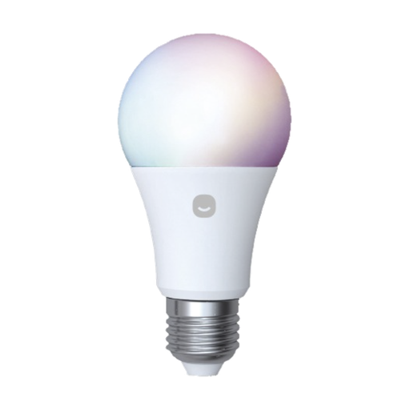

# 헤이홈 Z26의 8–10분 후 Zigbee 네트워크 이탈 문제

[Full technical report in English](README.md)

## 요약

서로 다른 생산 lot의 헤이홈 스마트 컬러 전구 Z26 두 개에서 같은 문제가 발생했다. 두 전구 모두 Zigbee 식별 정보가 `TS0505B` / `_TZ3210_cnicaghm`이고 app / hardware / stack version이 `66` / `1` / `0`이었다. 2026년 4월 `LOT26D15` 제품은 **8분 24초**, 2026년 2월 `LOT26B30` 제품은 밝기 명령 우회 설정이 적용된 상태에서도 **10분 19초** 뒤 네트워크에서 이탈했다.

공장 초기화와 재페어링, 새 전구로 교체, 밝기 명령 방식 변경, CC2652P2 coordinator firmware 업데이트만으로는 문제가 해결되지 않았다.

결정적인 단서는 GOQUAL의 공식 HejHome Homey driver 변경 이력에서 찾았다. Version 1.1.17은 Z26의 약 10분 후 self-leave 문제를 해결하기 위해 keep-alive를 `zclVersion` 5분 간격에서 `appVersion` 30초 간격으로 변경했다고 명시한다.

이를 바탕으로 Zigbee2MQTT external converter에 Basic cluster의 `appVersion`을 **120초마다 읽는 poll**을 추가했다. 2026년 2월 `LOT26B30` 제품은 계획된 host maintenance 전원 재시작 전까지 약 **34시간** 동안 네트워크에 남았고 새로운 leave event는 관찰되지 않았다. 중간에 조명 명령 timeout 한 번이 있었지만 Zigbee의 정상적인 retry/recovery 과정에서 회복했다. Maintenance 후 2026년 4월 `LOT26D15` 제품에도 같은 converter를 적용했으며, 초기 확인에서는 과거의 10분 failure boundary를 넘겨 online 상태를 유지했다.

초기 관찰에서는 self-leave를 억제했습니다. 펌웨어 자체를 수정한 것은 아니며, 아래 후속 점검에서도 장시간 통신 중단이 확인되어 영구적인 해결이나 연속 정상 동작으로 단정하지 않습니다.

## 2026년 9월 5일 후속 점검

두 전구 모두 Zigbee2MQTT 2.14.1과 zigbee-herdsman-converters 26.105.0에서 기존 120초 external converter를 사용하고 있었습니다. 읽기 전용 상태, 밝기, 색온도 요청에 두 전구가 모두 새 응답을 반환했으며 데이터베이스의 최근 통신 시각도 갱신되었습니다. 조명 설정은 변경하지 않았고 실제 점등, 밝기 변화, RGB 출력은 다시 시험하지 않았습니다.

보관된 8월 23일부터 9월 5일까지의 warning/error 로그에는 두 전구의 새로운 네트워크 이탈 기록이 없었습니다. 다만 전구당 availability ping 실패 37회와 재연결 후 상태 읽기 실패 2회가 있었습니다. 8월 30일부터 남아 있는 약 6일의 Home Assistant 기록에는 전구당 약 8.8시간의 사용 불가 상태가 있었습니다. 대부분은 bridge가 online인 동안 두 전구에서 함께 발생한 세 차례의 중단입니다. 사용자 기억으로는 9월 3일의 두 차례 장시간 중단 때 전원 스위치가 꺼졌을 가능성이 있지만 독립적으로 확인되지는 않았습니다. 9월 2일의 약 24분 중단은 원인이 불명확합니다. 따라서 이 시간을 keep-alive의 확인된 실패 시간으로 계산해서는 안 됩니다.

다른 Zigbee 장치와 비교하면 일부 장치는 해당 중단 전부터 이미 사용 불가 상태였습니다. 하지만 별도의 Zigbee 전력 측정 장치는 세 구간 모두에서 최대 45초 이하의 간격으로 변화한 측정값을 계속 보냈습니다. 다른 온도 센서도 갱신되었으며, 9월 3일에는 다른 전구의 상태 변화도 이어졌습니다. 따라서 해당 시간 내내 전체 Zigbee 네트워크가 중단된 것은 아니지만, 일부 mesh 경로의 문제까지 배제할 수는 없습니다.

따라서 기존 self-leave 문제의 완화와 현재 통신 응답은 확인했지만, 3주 연속 정상 동작이나 이후 통신 중단까지 해결되었다고 판단할 수는 없습니다. Warning 수준 로그만으로는 성공한 keep-alive의 연속 기록도 확인할 수 없습니다. 자세한 범위와 한계는 [후속 관찰 기록](evidence/observations.md#september-5-follow-up)을 참고하세요.

같은 날짜의 공개 검색에서는 정확한 fingerprint에 대한 새로운 독립적인 해결책이나 공개 OTA 이미지를 찾지 못했습니다. GOQUAL의 Homey 페이지는 여전히 1.1.17의 같은 우회 방법을 안내합니다. 검색에서 찾지 못했다는 사실이 자료의 부재를 증명하지는 않으며, 이 프로젝트의 블로그 글은 독립적인 검증 자료로 세지 않았습니다.

## Zigbee2MQTT 정식 지원 제안

9월 5일, 정확한 fingerprint에만 적용하는 [장치 정의 PR #13122](https://github.com/Koenkk/zigbee-herdsman-converters/pull/13122)와 [제품 이미지 및 문서 PR #5490](https://github.com/Koenkk/zigbee2mqtt.io/pull/5490)를 제출했습니다. 모든 `TS0505B` 전구에 일괄 적용하지 않습니다. 120초는 경험적으로 시험한 값이며 GOQUAL은 30초를 사용한다는 점, 이후 통신 중단의 원인이 아직 확인되지 않았다는 점을 함께 설명했습니다. 로컬에서 build, lint, 기존 테스트 844개, benchmark 및 별도의 fingerprint와 polling lifecycle 검증을 통과했습니다. 현재 maintainer 검토를 기다리는 단계이며 제출만으로 정식 Zigbee2MQTT 버전에 포함된 것은 아닙니다. 내장 정의가 포함된 버전이 출시되기 전까지는 기존 external converter를 유지하세요.

## 대상 제품

*제품 식별에 사용한 헤이홈 Z26 이미지.*

| 항목 | 값 |
| --- | --- |
| 제품 | 헤이홈 스마트 컬러 전구 Z26 |
| 모델명 | `GKZ-LB431RGBCW-E26` |
| Zigbee model | `TS0505B` |
| Manufacturer fingerprint | `_TZ3210_cnicaghm` |
| App / hardware / stack version | `66` / `1` / `0` |
| 시험 제품 | 2026년 2월 제조 `LOT26B30`; 2026년 4월 제조 `LOT26D15` |

## 우회 방법

[`external_converter/hejhome-z26.mjs`](external_converter/hejhome-z26.mjs)를 Zigbee2MQTT의 `external_converters` 폴더에 설치한다. 이 converter는 정확히 `TS0505B` / `_TZ3210_cnicaghm` fingerprint에만 적용되며 `genBasic.appVersion`을 120초 간격으로 읽는다.

GOQUAL의 Homey driver는 30초 간격을 사용한다. 120초는 우리가 관찰한 8–10분 failure window 안에서 여러 번의 poll 실패를 허용하면서 traffic을 줄이기 위해 선택한 경험적 값이다. 다른 간격을 체계적으로 비교한 결과는 아직 없다.

상세한 재현 기록, 실패한 시도, 설치법, 관련 근거와 한계는 [영문 기술 보고서](README.md)에 정리했다.

## 주의

- `_TZ3210_cnicaghm`이 아닌 다른 `TS0505B` 제품에 결과를 일반화하면 안 된다.
- External converter는 Zigbee2MQTT 내부에서 JavaScript로 실행되므로 코드를 검토한 뒤 사용해야 한다.
- Zigbee IEEE address, network key, 가정 내 entity name 등은 issue에 올리지 않는 것이 좋다.
- 같은 제품을 사용한다면 제조년월, lot, `appVersion`, polling interval과 관찰 시간을 공유해주면 도움이 된다.
- 이전에 계획했던 24시간과 7일 점검은 연속 기록이 없어 소급 확인할 수 없습니다. 현재 판단에는 9월 5일 후속 점검의 범위와 한계를 적용하세요.
