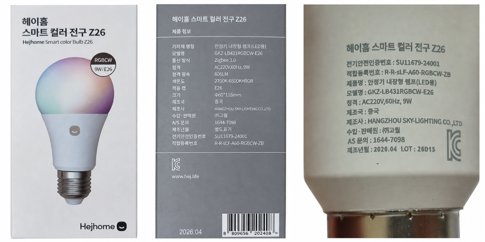

# HejHome Z26 leaves Zigbee2MQTT after 8–10 minutes

[한국어 요약](README.ko.md)

## Summary

Two HejHome Z26 bulbs from different production lots, both identified as `TS0505B` / `_TZ3210_cnicaghm`, repeatedly left the Zigbee network shortly after joining. The April 2026 `LOT26D15` unit left after **8 minutes 24 seconds**; the February 2026 `LOT26B30` unit left after **10 minutes 19 seconds** while a level-control workaround was active. Resetting, re-pairing, replacing the bulb, changing the level-control command, and updating the coordinator firmware did not independently prevent recurrence.

The decisive clue came from GOQUAL's official HejHome driver for Homey. Its version 1.1.17 changelog says that the Z26 keep-alive was changed from a five-minute `zclVersion` read to a 30-second `appVersion` read to fix an approximately ten-minute self-leave issue.

We added a fingerprint-specific Zigbee2MQTT external converter that reads the Basic cluster's `appVersion` attribute every **120 seconds**. The February unit remained joined for approximately **34 hours**, ending only when the Zigbee2MQTT host underwent a planned maintenance power cycle. One lighting-command timeout recovered through normal Zigbee retry/recovery; no new leave event was observed. After maintenance, the April unit was also installed with the same converter and remained online past the previous 10-minute failure boundary in its initial replication check.

This is an **experimental mitigation**, not a firmware fix. A September 5 follow-up confirmed both bulbs responding with the same converter, but also found extended availability interruptions. See the [current follow-up](#september-5-follow-up) before interpreting the initial results as long-term reliability.

## September 5 follow-up

Both tested bulbs were still using the exact-fingerprint external converter with a 120-second interval on Zigbee2MQTT 2.14.1 and zigbee-herdsman-converters 26.105.0. Both answered fresh read-only requests for on/off state, brightness, and color temperature. Database activity timestamps advanced during the check. No lighting settings were changed, and physical switching, dimming, and RGB output were not retested.

The retained warning/error logs covered August 23 through September 5. They contained no recorded network leave for either bulb, but included 37 failed availability pings and two failed post-reconnect reads per bulb. Home Assistant history was available only from August 30, approximately six days, and recorded about 8.8 hours of unavailability per bulb, mostly in three shared interruptions while the bridge stayed online. The owner recalled a likely mains-switch power-off during the two longer September 3 interruptions, but this was not independently verified. The approximately 24-minute September 2 interruption remains unexplained. These periods cannot be counted as confirmed failures of the keep-alive. Warning-level logs do not provide a continuous record of successful keep-alive reads.

The evidence supports mitigation of the originally reproduced self-leave, and confirms that both bulbs currently respond. It does **not** establish uninterrupted three-week operation or resolve the later communication interruptions. See [sanitized follow-up observations](evidence/observations.md#september-5-follow-up).



*HejHome Z26 retail packaging and the marking on the April 2026 `LOT26D15` unit.*

## Affected device


*HejHome Z26 product image used for device identification.*

| Field | Observed value |
| --- | --- |
| Product | HejHome Smart Color Bulb Z26 |
| Retail model | `GKZ-LB431RGBCW-E26` |
| Certified base model | `A60-RGBCW-ZB` |
| Zigbee model | `TS0505B` |
| Manufacturer fingerprint | `_TZ3210_cnicaghm` |
| Application / hardware / stack version | `66` / `1` / `0` |
| Endpoint | `1` |
| Basic cluster | `genBasic` (`0x0000`) |
| Lamp specification | E26, 9 W, 806 lm, RGB + 2700–6500 K white |
| Tested batches | Manufactured 2026-02, lot `26B30`; manufactured 2026-04, lot `26D15` |

The retail model is listed as a derivative of `A60-RGBCW-ZB` in the [Korean Safety Korea certification record](https://www.safetykorea.kr/release/certDetail?certNum=SU11679-24001&certUid=5795000). It is manufactured in China by Hangzhou Sky-Lighting and sold in Korea under GOQUAL's HejHome brand.

## Test environment

| Component | Version or setting |
| --- | --- |
| Home Assistant | 2026.8.1 |
| Zigbee2MQTT | 2.13.0 |
| Coordinator | CC2652P2-class Z-Stack coordinator |
| Coordinator firmware | `20240710` |
| Zigbee channel | 11 |
| Converter match | Exact fingerprint only: `TS0505B` + `_TZ3210_cnicaghm` |

No household entity names, Zigbee IEEE addresses, network identifiers, credentials, or physical layout information are included in this report.

## Reproduced behavior

The important observation was not merely that the bulb became unavailable. Zigbee2MQTT recorded that the device **left the network**, after which its Zigbee database entry disappeared.

| Observation | Result |
| --- | --- |
| 2026-04 `LOT26D15` unit | Left 8 min 24 s after joining without keep-alive |
| 2026-02 `LOT26B30` unit | Left 10 min 19 s after joining with the level-control workaround but without keep-alive |
| Re-pairing | Restored operation temporarily |
| Home Assistant retained state | Could remain apparently on after the physical device had left; not connectivity evidence |

Both bulbs exposed the same fingerprint, application version, hardware version, stack version, and endpoint/cluster layout.

## What did not solve it

| Intervention | Outcome |
| --- | --- |
| Factory reset and re-pair | Temporary recovery only |
| Replacement with a second Z26 | The same general self-leave behavior recurred |
| Disable `moveToLevelWithOnOff` | Normal control worked initially, but the bulb still left after 10 min 19 s |
| Coordinator firmware update (`20210320` → `20240710`) | Coordinator upgrade succeeded, but the bulb later became registered-but-unresponsive |
| MQTT/Home Assistant changes | Did not address a leave initiated at the Zigbee device/network layer |

The level-control workaround was therefore removed. The published converter contains only the device-specific keep-alive plus the normal Tuya RGB+CCT definition.

## External corroboration

The strongest public evidence is the [official HejHome app page for Homey](https://homey.app/en-de/app/com.hejhome.iot/Hejhome/), maintained by GOQUAL. Its version 1.1.17 changelog states:

> Z26 color bulb: switch keep-alive from zclVersion/5min to appVersion/30s to fix the ~10-minute self-leave issue.

This disclosure independently matches the symptom and timing observed with our two bulbs. It also shows that another HejHome integration treats periodic Basic-cluster reads as a required device-specific keep-alive.

The September 5, 2026 search found no exact-fingerprint match in GitHub issue search or the upstream converter code search. The [Tuya source inspected at that date](https://github.com/Koenkk/zigbee-herdsman-converters/blob/cf6e6596facaf36cc850e4e904f55748492ce13d/src/devices/tuya.ts) did not include `_TZ3210_cnicaghm`. The generic [Tuya `TS0505B_1` definition](https://www.zigbee2mqtt.io/devices/TS0505B_1.html) provides lighting features but does not document this keep-alive quirk. GOQUAL's Homey page still listed version 1.1.17 and the same workaround. No newer independent exact-device fix or public OTA image was located. Search absence is not proof that none exists, and this project's own blog report is not independent corroboration.

Other `TS0505B` reports provide useful context but involve different products or fingerprints; they are not proof of the Z26 defect. Examples include [Zigbee2MQTT issue #21761](https://github.com/Koenkk/zigbee2mqtt/issues/21761), [issue #19656](https://github.com/Koenkk/zigbee2mqtt/issues/19656), and a [Home Assistant Community report](https://community.home-assistant.io/t/zigbee-ceiling-light-keeps-going-totally-offline-and-throwing-whole-network/776897).

## Hypothesis

The Z26 firmware may contain an inactivity or watchdog mechanism that is refreshed by selected Basic-cluster traffic. Without that traffic, this firmware variant appears to initiate a network leave after approximately 8–10 minutes. Reading `appVersion` may refresh the relevant internal state.

This mechanism is not proven. The available evidence does not establish:

- whether any successful Zigbee request would work;
- whether `appVersion` is uniquely required;
- whether the attribute choice or the polling interval is the decisive factor;
- why GOQUAL selected 30 seconds; or
- whether every Z26 batch behaves identically.

## Zigbee2MQTT workaround

The tested converter is in [`external_converter/hejhome-z26.mjs`](external_converter/hejhome-z26.mjs). Its essential addition is:

```javascript
poll({
    key: 'hejhome_z26_app_version_keepalive',
    defaultIntervalSeconds: 120,
    poll: async (device) => {
        await device.getEndpoint(1).read('genBasic', ['appVersion']);
    },
})
```

GOQUAL uses a 30-second interval in its Homey driver. We selected 120 seconds because the observed leave window was 8–10 minutes, leaving room for multiple failed cycles while reducing routine network traffic. This interval is empirical and should not yet be treated as universally safe.

### Installation

1. Confirm that the device fingerprint is exactly `TS0505B` / `_TZ3210_cnicaghm`.
2. Review the converter source. External JavaScript runs inside Zigbee2MQTT.
3. Copy `hejhome-z26.mjs` into the `external_converters` directory beside the Zigbee2MQTT `configuration.yaml`, or save it through **Settings → Dev console → External converters**.
4. On Zigbee2MQTT 2.11.0 and later, ensure external JavaScript is enabled:

   ```yaml
   advanced:
     enable_external_js: true
   ```

5. Restart Zigbee2MQTT and confirm that the device is recognized as `TS0505B_1_cnicaghm`.
6. With debug logging temporarily enabled, confirm a line similar to:

   ```text
   Polling 'hejhome_z26_app_version_keepalive' ... at an interval of 120
   ```

7. Confirm repeated `genBasic` read responses containing `appVersion: 66`.

See the official [Zigbee2MQTT external converter documentation](https://www.zigbee2mqtt.io/advanced/more/external_converters.html). Only run external converters that you have reviewed and trust.

## Initial result

| Period | Observation |
| --- | --- |
| 30-second polling test | Repeated `appVersion: 66` responses; one poll timeout recovered on the next cycle; no leave in the short validation window |
| 120-second polling test | Crossed the prior 8–10-minute window with six consecutive responses |
| Continued normal use | February `LOT26B30` unit remained joined for approximately 34 hours, ending with a planned host power cycle |
| Preliminary second-unit replication | April `LOT26D15` unit received the same converter and remained online past its previous 10-minute failure boundary during the initial check |
| Lighting commands | One later timeout recovered; subsequent commands succeeded |
| Leave events after polling began | None observed during the recorded polling periods |

The correct interpretation is: **periodic `appVersion` reads prevented the reproduced self-leave during the observed period**. The data do not yet prove a permanent cure or eliminate all possible command latency.

## Limitations

- Only two Z26 bulbs, from two production lots, were observed.
- Both units responded in the September follow-up, but neither has a complete uninterrupted long-term observation record.
- The 120-second interval has not been compared systematically with 30, 60, 180, or 300 seconds.
- The shared availability interruptions need context, including whether mains power was intentionally removed.
- No public Zigbee2MQTT OTA path was available for this fingerprint during testing.
- Findings for `_TZ3210_cnicaghm` must not be generalized to every device using the broad `TS0505B` model identifier.

## Status

This report is a living case record. Please open a GitHub issue if you have the same fingerprint, especially if you can provide:

- production month and lot;
- `appVersion`, hardware version, and stack version;
- time from pairing to `leaveInd` without polling;
- polling attribute and interval; and
- observation duration with the workaround.

The September 5 follow-up supersedes the earlier planned 24-hour and seven-day checks. Those checkpoints were not continuously recorded and cannot be reconstructed from the retained evidence.

### Upstream contribution path

The proposed change belongs in `zigbee-herdsman-converters`, using an exact `TS0505B` / `_TZ3210_cnicaghm` match and the existing lifecycle-managed polling helper. It should identify the HejHome Z26 retail model and preserve normal Tuya RGB+CCT behavior. A generic change for all `TS0505B` bulbs would extend beyond the evidence.

The [official contribution guide](https://www.zigbee2mqtt.io/advanced/support-new-devices/01_support_new_devices.html) describes submitting the definition to the converter repository and a device image plus optional notes to `zigbee2mqtt.io`. The notes should explain the keep-alive requirement, the empirically tested 120-second interval, GOQUAL's 30-second choice, and the unresolved reliability limits. Regression checks should cover fingerprint selection, polling lifecycle, and unaffected generic devices before submission. Maintainer review determines acceptance and release timing. No upstream Z26 pull request has been submitted by this project as of this follow-up.

Do not publish Zigbee IEEE addresses, network keys, household entity names, or unredacted configuration files.

## References

- [HejHome Z26 product page](https://m.hej.life/product/detail.html?product_no=328)
- [Safety Korea certification: SU11679-24001](https://www.safetykorea.kr/release/certDetail?certNum=SU11679-24001&certUid=5795000)
- [GOQUAL HejHome app for Homey, version 1.1.17 changelog](https://homey.app/en-de/app/com.hejhome.iot/Hejhome/)
- [Zigbee2MQTT generic TS0505B_1 support](https://www.zigbee2mqtt.io/devices/TS0505B_1.html)
- [Zigbee2MQTT external converters](https://www.zigbee2mqtt.io/advanced/more/external_converters.html)
- [Related TS0505B issue #21761](https://github.com/Koenkk/zigbee2mqtt/issues/21761)
- [Related TS0505B fingerprint issue #19656](https://github.com/Koenkk/zigbee2mqtt/issues/19656)

## License

The report and photograph composite are licensed under [CC BY 4.0](LICENSE-DOCUMENTATION.md). The external converter is licensed under the [MIT License](LICENSE-CODE).
